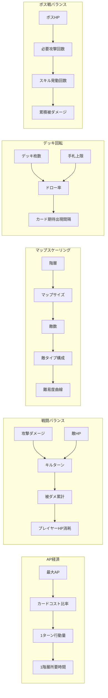

# バランスシート

パラメータ間の**影響関係**を可視化し、調整時の連鎖的影響を把握するためのドキュメント。

> **数値はすべて [constants.md](./constants.md) を参照。本ドキュメントに数値を転記しない。**
> 体験目標値は [gdd.md](./gdd.md) を参照。

## パラメータ一覧

### 1. 行動リソース

| ID | パラメータ名 | 参照先 | 影響先 | 体験指標への影響 |
|----|-------------|--------|--------|-----------------|
| A-1 | 最大AP | [constants.md#行動関連](./constants.md#行動関連) | カードコスト比率、1ターン行動量 | 1階層あたり所要時間 |
| A-2 | ターン開始時AP | [constants.md#行動関連](./constants.md#行動関連) | 1ターン行動量 | 1階層あたり所要時間 |
| A-3 | 初期手札上限 | [constants.md#行動関連](./constants.md#行動関連) | ドロー率、カード期待出現間隔 | カード使用率 |

### 2. デッキ構成

| ID | パラメータ名 | 参照先 | 影響先 | 体験指標への影響 |
|----|-------------|--------|--------|-----------------|
| B-1 | デッキ最大枚数 | [constants.md#デッキ枚数制約](./constants.md#デッキ枚数制約) | ドロー率、カード期待出現間隔 | カード使用率 |
| B-2 | デッキ最小枚数 | [constants.md#デッキ枚数制約](./constants.md#デッキ枚数制約) | カード除去の下限 | デッキ圧縮の天井 |
| B-3 | 初期デッキ内訳（6種） | [constants.md#初期デッキ](./constants.md#初期デッキ) | 序盤の手札構成、カード期待出現間隔 | カード使用率、序盤難易度 |

### 3. カードAPコスト

| ID | パラメータ名 | 参照先 | 影響先 | 体験指標への影響 |
|----|-------------|--------|--------|-----------------|
| C-1 | 移動カードコスト | [constants.md#カードAPコスト](./constants.md#カードapコスト) | 1ターン移動回数 | 1階層あたり所要時間 |
| C-2 | 攻撃カードコスト | [constants.md#カードAPコスト](./constants.md#カードapコスト) | 1ターン攻撃回数 | キルターン数 |
| C-3 | 強攻撃カードコスト | [constants.md#カードAPコスト](./constants.md#カードapコスト) | AP対ダメージ効率 | キルターン数 |
| C-4 | ジャンプカードコスト | [constants.md#カードAPコスト](./constants.md#カードapコスト) | 1ターン移動距離 | 1階層あたり所要時間 |
| C-5 | 待機カードコスト | [constants.md#カードAPコスト](./constants.md#カードapコスト) | 手札回転速度 | カード使用率 |
| C-6 | 回復カードコスト | [constants.md#カードAPコスト](./constants.md#カードapコスト) | 回復の機会コスト | HP消耗ペース |
| C-7 | 貫通攻撃カードコスト | [constants.md#カードAPコスト](./constants.md#カードapコスト) | 遠距離攻撃の機会コスト | キルターン数 |

### 4. カード効果値

| ID | パラメータ名 | 参照先 | 影響先 | 体験指標への影響 |
|----|-------------|--------|--------|-----------------|
| D-1 | 攻撃カードダメージ | [constants.md#ダメージ](./constants.md#ダメージ) | キルターン数 | 1階層あたり所要時間 |
| D-2 | 強攻撃カードダメージ | [constants.md#ダメージ](./constants.md#ダメージ) | キルターン数 | ボス戦所要時間 |
| D-3 | 貫通攻撃カードダメージ | [constants.md#ダメージ](./constants.md#ダメージ) | 遠距離キルターン数 | 1階層あたり所要時間 |
| D-4 | 貫通攻撃カード射程 | [constants.md#ダメージ](./constants.md#ダメージ) | 安全な攻撃機会 | 被ダメ累計 |
| D-5 | 回復カード回復量 | [constants.md#回復](./constants.md#回復) | HP回復効率 | 到達階層 |
| D-6 | 移動距離 | [constants.md#移動](./constants.md#移動) | 1ターン移動量 | 1階層あたり所要時間 |
| D-7 | ジャンプ着地距離 | [constants.md#移動](./constants.md#移動) | 1ターン移動量、回避能力 | 1階層あたり所要時間 |

### 5. プレイヤー

| ID | パラメータ名 | 参照先 | 影響先 | 体験指標への影響 |
|----|-------------|--------|--------|-----------------|
| E-1 | プレイヤー初期HP | [constants.md#hp体力](./constants.md#hp体力) | 許容被ダメ回数、ランの継続力 | 到達階層 |

### 6. 敵タイプ別

| ID | パラメータ名 | 参照先 | 影響先 | 体験指標への影響 |
|----|-------------|--------|--------|-----------------|
| F-1 | 通常敵HP | [constants.md#敵タイプ別パラメータ](./constants.md#敵タイプ別パラメータ) | キルターン数 | 1階層あたり所要時間 |
| F-2 | 重装敵HP | [constants.md#敵タイプ別パラメータ](./constants.md#敵タイプ別パラメータ) | キルターン数 | 1階層あたり所要時間 |
| F-3 | 俊敏敵HP | [constants.md#敵タイプ別パラメータ](./constants.md#敵タイプ別パラメータ) | キルターン数 | 1階層あたり所要時間 |
| F-4 | ミニボスHP | [constants.md#敵タイプ別パラメータ](./constants.md#敵タイプ別パラメータ) | 必要攻撃回数、スキル発動回数 | ボス戦所要時間 |
| F-5 | ボスHP | [constants.md#敵タイプ別パラメータ](./constants.md#敵タイプ別パラメータ) | 必要攻撃回数、スキル発動回数 | ボス戦所要時間 |
| F-6 | 各敵攻撃ダメージ | [constants.md#敵タイプ別パラメータ](./constants.md#敵タイプ別パラメータ) | プレイヤーHP消耗速度 | 到達階層 |
| F-7 | 各敵移動距離 | [constants.md#敵タイプ別パラメータ](./constants.md#敵タイプ別パラメータ) | 敵の接近速度、回避猶予 | 被ダメ頻度 |
| F-8 | 各敵索敵範囲 | [constants.md#敵タイプ別パラメータ](./constants.md#敵タイプ別パラメータ) | 敵のアクティブ化タイミング | 同時交戦数 |

### 7. ボス特殊スキル

| ID | パラメータ名 | 参照先 | 影響先 | 体験指標への影響 |
|----|-------------|--------|--------|-----------------|
| G-1 | 強化攻撃の発動確率 | [constants.md#ミニボス-強化攻撃power_strike](./constants.md#ミニボス-強化攻撃power_strike) | スキル発動回数 | ボス戦所要時間、被ダメ累計 |
| G-2 | 強化攻撃のダメージ倍率 | [constants.md#ミニボス-強化攻撃power_strike](./constants.md#ミニボス-強化攻撃power_strike) | スキル被ダメージ | 到達階層 |
| G-3 | 範囲攻撃の発動確率 | [constants.md#ボス-範囲攻撃area_attack](./constants.md#ボス-範囲攻撃area_attack) | スキル発動回数 | ボス戦所要時間、被ダメ累計 |
| G-4 | 範囲攻撃のダメージ | [constants.md#ボス-範囲攻撃area_attack](./constants.md#ボス-範囲攻撃area_attack) | スキル被ダメージ | 到達階層 |
| G-5 | 範囲攻撃の射程 | [constants.md#ボス-範囲攻撃area_attack](./constants.md#ボス-範囲攻撃area_attack) | 安全距離、回避難度 | ボス戦所要時間 |
| G-6 | 激昂の発動条件 | [constants.md#ボス-激昂enrage](./constants.md#ボス-激昂enrage) | 後半戦の被ダメージ量 | ボス戦所要時間 |
| G-7 | 激昂の攻撃ダメージ増加 | [constants.md#ボス-激昂enrage](./constants.md#ボス-激昂enrage) | 後半戦の被ダメージ量 | 到達階層 |

### 8. 階層進行

| ID | パラメータ名 | 参照先 | 影響先 | 体験指標への影響 |
|----|-------------|--------|--------|-----------------|
| H-1 | クリア階層 | [constants.md#階層](./constants.md#階層) | 1ランの階層数 | 1ランの所要時間 |
| H-2 | ボス階層配置 | [constants.md#ボス階層](./constants.md#ボス階層) | 難易度の山の位置 | 到達階層分布 |

### 9. マップ生成

| ID | パラメータ名 | 参照先 | 影響先 | 体験指標への影響 |
|----|-------------|--------|--------|-----------------|
| I-1 | 最小パーティションサイズ | [constants.md#bspパラメータ](./constants.md#bspパラメータ) | 部屋の最小面積 | マップの開放感 |
| I-2 | 最小部屋サイズ | [constants.md#bspパラメータ](./constants.md#bspパラメータ) | 戦闘空間の狭さ | 回避の余地 |
| I-3 | 通路の幅 | [constants.md#bspパラメータ](./constants.md#bspパラメータ) | 通路での戦闘発生率 | 1対1交戦の頻度 |
| I-4 | 最大分割深度 | [constants.md#bspパラメータ](./constants.md#bspパラメータ) | 部屋数 | マップの複雑さ |
| I-5 | 階層別マップサイズ | [constants.md#階層別マップサイズ](./constants.md#階層別マップサイズ) | 探索距離、遭遇数 | 1階層あたり所要時間 |
| I-6 | 階層別敵配置数 | [constants.md#階層別敵配置数](./constants.md#階層別敵配置数) | 戦闘回数、被ダメ累計 | 1階層あたり所要時間、到達階層 |
| I-7 | 階層別敵タイプ構成 | [constants.md#階層別敵配置テーブル](./constants.md#階層別敵配置テーブル) | 階層ごとの難易度 | 到達階層分布 |
| I-8 | 階層別特殊タイル配置数 | [constants.md#階層別特殊タイル配置数](./constants.md#階層別特殊タイル配置数) | 回復機会、罠リスク | 到達階層 |

### 10. 特殊タイル効果

| ID | パラメータ名 | 参照先 | 影響先 | 体験指標への影響 |
|----|-------------|--------|--------|-----------------|
| J-1 | 罠タイルダメージ | [constants.md#特殊タイルの効果](./constants.md#特殊タイルの効果) | HP消耗速度 | 到達階層 |
| J-2 | 宝箱タイルHP回復量 | [constants.md#特殊タイルの効果](./constants.md#特殊タイルの効果) | HP回復効率 | 到達階層 |
| J-3 | 休憩所タイルHP回復量 | [constants.md#特殊タイルの効果](./constants.md#特殊タイルの効果) | ランの継続力 | 到達階層 |

### 11. デッキ構築

| ID | パラメータ名 | 参照先 | 影響先 | 体験指標への影響 |
|----|-------------|--------|--------|-----------------|
| K-1 | カード除去発生確率 | [constants.md#カード除去](./constants.md#カード除去) | デッキ圧縮速度 | カード使用率 |
| K-2 | コモン出現率 | [constants.md#レアリティ出現率](./constants.md#レアリティ出現率) | デッキの基本カード密度 | カード使用率 |
| K-3 | アンコモン出現率 | [constants.md#レアリティ出現率](./constants.md#レアリティ出現率) | 強攻撃・回復の入手頻度 | キルターン数、到達階層 |
| K-4 | レア出現率 | [constants.md#レアリティ出現率](./constants.md#レアリティ出現率) | ジャンプ・貫通の入手頻度 | 高階層での戦術幅 |

## パラメータ間の影響関係

### 影響チェーンダイアグラム

### テキスト補足：主要パラメータの双方向影響

#### AP経済チェーン

- **最大AP（A-1）**
  - 影響を与える先: カードコスト比率（コスト2のカードが使いやすいか）、1ターンの行動量
  - 影響を受ける元: （根幹パラメータのため外部依存なし）
- **カードAPコスト（C-1〜C-7）**
  - 影響を与える先: 1ターンあたりのカード使用枚数、AP対効果の効率
  - 影響を受ける元: 最大AP（コストが最大APに占める割合が使用感を決める）

#### 戦闘バランスチェーン

- **攻撃ダメージ（D-1〜D-3）**
  - 影響を与える先: キルターン数（敵HP ÷ ダメージ）、1階層の戦闘所要時間
  - 影響を受ける元: カードAPコスト（AP対ダメージ効率）
- **敵HP（F-1〜F-5）**
  - 影響を与える先: キルターン数、被ダメ累計（戦闘が長引くほど被弾する）
  - 影響を受ける元: 階層別敵タイプ構成（高HP敵の出現率）
- **プレイヤー初期HP（E-1）**
  - 影響を与える先: 許容被ダメ回数、ランの継続力
  - 影響を受ける元: 敵攻撃ダメージ、回復手段の量と効率

#### マップスケーリングチェーン

- **階層別マップサイズ（I-5）**
  - 影響を与える先: 探索距離、敵との遭遇頻度、1階層の所要時間
  - 影響を受ける元: 階層番号
- **階層別敵配置数（I-6）**
  - 影響を与える先: 1階層の戦闘回数、被ダメ累計
  - 影響を受ける元: マップサイズ（広いマップに多くの敵を配置）
- **階層別敵タイプ構成（I-7）**
  - 影響を与える先: 階層ごとの難易度、必要な戦術
  - 影響を受ける元: 階層番号（後半ほど重装敵・俊敏敵が増加）

#### デッキ回転チェーン

- **デッキ枚数（B-1, B-3）**
  - 影響を与える先: 特定カードの出現確率、手札の偏り
  - 影響を受ける元: 初期デッキ内訳、カード除去・追加イベント
- **手札上限（A-3）**
  - 影響を与える先: 1ターンの選択肢の幅、ドロー率
  - 影響を受ける元: （根幹パラメータのため外部依存なし）

#### ボス戦バランスチェーン

- **ボスHP（F-4, F-5）**
  - 影響を与える先: 必要攻撃回数、ボス戦所要ターン数
  - 影響を受ける元: （根幹パラメータのため外部依存なし）
- **スキル発動回数（G-1, G-3 × 戦闘ターン数）**
  - 影響を与える先: 累積被ダメージ、回避判断の回数
  - 影響を受ける元: ボスHP（HPが高い＝戦闘が長い＝発動機会が増える）
- **激昂（G-6, G-7）**
  - 影響を与える先: 後半戦の被ダメージ量（ダメージ+2は初期HPの20%相当）
  - 影響を受ける元: ボスHP（HP50%以下で発動）

## 調整チェックリスト

パラメータ変更時に確認すべき項目。[gdd.md](./gdd.md) の目標値との整合を確認する。

### 最大APを変更したら

- [ ] カードAPコスト比率を確認（コスト2カードが1ターンに1枚使えるか）
- [ ] 1ターンの行動量が変わるため、1階層あたり所要時間が目標（30〜45秒）に収まるか
- [ ] 待機カード（コスト0）の相対価値が変わっていないか

### プレイヤー初期HPを変更したら

- [ ] 敵攻撃ダメージとの比率を確認（何発で倒されるか）
- [ ] 回復手段（回復カード、宝箱、休憩所）の回復量とバランスが取れているか
- [ ] 到達階層分布が目標（初心者3〜5F、中級者8〜12F）と合致するか

### 敵HPを変更したら

- [ ] 攻撃カードダメージとの比率を確認（キルターン数が妥当か）
- [ ] 強攻撃カードの相対価値が変わっていないか（コスト2の価値に見合うか）
- [ ] 1階層あたり所要時間が目標（30〜45秒）に収まるか

### カードAPコストを変更したら

- [ ] 最大APとの比率を確認（1ターンの行動パターンが成立するか）
- [ ] 全カード種別の使用率が10%以上を維持するか
- [ ] 変更対象カードが「死にカード」にならないか

### 敵攻撃ダメージを変更したら

- [ ] プレイヤー初期HPとの比率を確認（何発で倒されるか）
- [ ] 回復手段の回復量とバランスが取れているか
- [ ] 到達階層分布が目標と合致するか
- [ ] ボスの激昂後ダメージ（+2）が致命的すぎないか

### マップサイズ・敵配置数を変更したら

- [ ] 1階層あたり所要時間が目標（30〜45秒）に収まるか
- [ ] 敵密度（敵数 ÷ マップ面積）が適切か
- [ ] 特殊タイル配置数とのバランスを確認
- [ ] BSPの最小パーティションサイズとの整合を確認

### レアリティ出現率を変更したら

- [ ] 全カード種別の使用率が10%以上を維持するか
- [ ] レアカード（ジャンプ・貫通攻撃）の入手頻度が極端すぎないか
- [ ] デッキ構築の選択肢として意味のある確率差が維持されているか

### ボス特殊スキルを変更したら

- [ ] ボス戦所要時間が目標（1〜2分）に収まるか
- [ ] スキルによる累積被ダメージがプレイヤーHPに対して致命的すぎないか
- [ ] 到達階層分布が目標（5Fミニボスが初心者の壁、10F大ボスが中級者の壁）と合致するか
- [ ] 回避手段（移動・ジャンプ）で対応可能な設計になっているか
